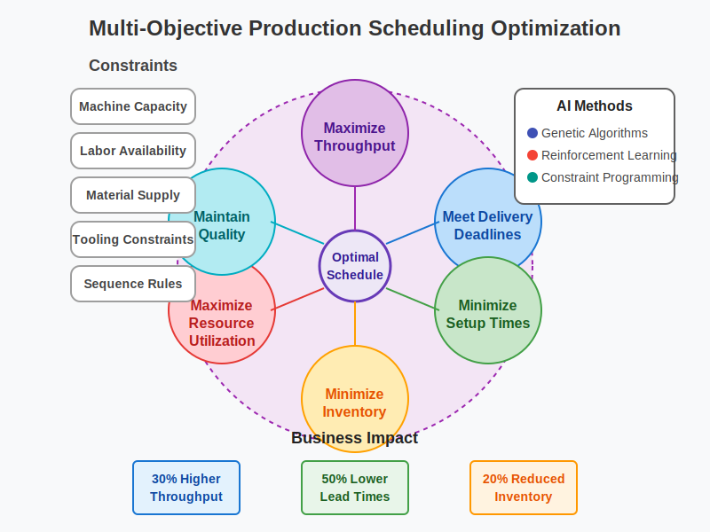
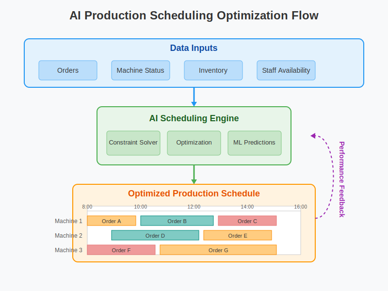
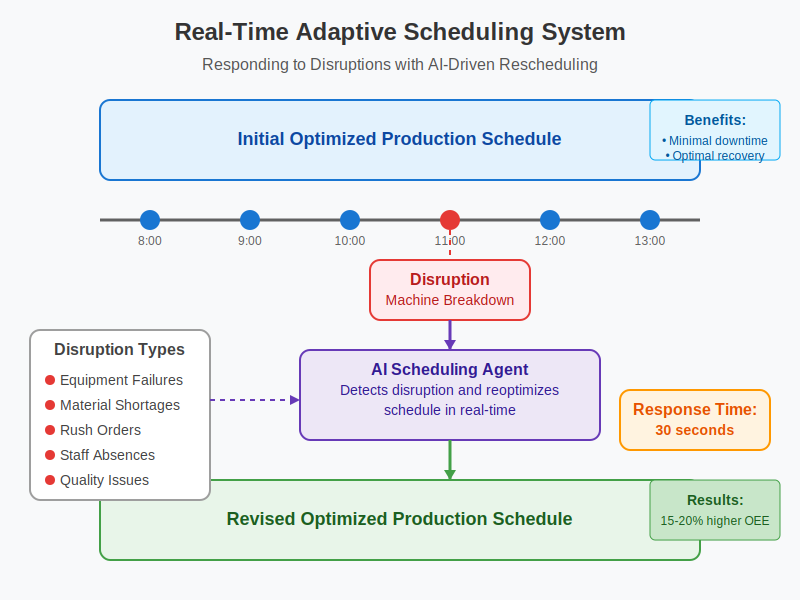

# AI-Powered Production Scheduling
## The Next Evolution in Manufacturing

---

## The Manufacturing Challenge

### Today's factory floor faces unprecedented complexity:

- Shorter product lifecycles
- Higher mix, lower volume production
- Supply chain disruptions
- Labor shortages
- Rising customer expectations
- Global competition

### Traditional scheduling approaches are breaking under pressure

---

## Production Scheduling: The Hidden Opportunity

- Production scheduling is **the central nervous system** of your manufacturing operation
- Sub-optimal scheduling directly impacts:
  - **Throughput** - Are you maximizing production capacity?
  - **On-time delivery** - Are you meeting customer commitments?
  - **Inventory levels** - Are you carrying excess WIP?
  - **Equipment utilization** - Are your assets being used efficiently?
  - **Changeover time** - Are you losing valuable production time?

---

## Introducing AI-Powered Production Scheduling

Our solution transforms your scheduling process with:

1. **Advanced optimization algorithms** that balance multiple objectives simultaneously
2. **Real-time adaptability** to handle disruptions within seconds
3. **Learning capabilities** that improve over time
4. **Digital twin integration** to simulate and validate schedule changes before implementation

---

## Multi-Objective Optimization

Traditional scheduling focuses on a single KPI. Our AI solution balances **all your critical objectives simultaneously**:

---

## Real-Time Adaptive Scheduling

When disruptions happen (and they always do), our system responds in real-time:

- Machine breakdowns
- Material shortages
- Rush orders
- Staff absences
- Quality issues

---

## Case Study: Precision Electronics Manufacturer

**Before Implementation:**
- 68% On-Time Delivery
- 46% Equipment Utilization
- 27 Days Average Lead Time
- 4.2 Hours Average Setup Time per Day

**After Implementation:**
- 96% On-Time Delivery (+28%)
- 73% Equipment Utilization (+27%)
- 14 Days Average Lead Time (-48%)
- 2.3 Hours Average Setup Time per Day (-45%)

**ROI achieved in under 6 months**

---

## Implementation Approach

Our proven 4-phase methodology:

1. **Assessment** (1-2 weeks)
   - Current state analysis
   - Value opportunity identification
   - Data readiness assessment

2. **Pilot** (2-4 weeks)
   - Single production line/cell
   - Integration with existing systems
   - ROI validation

3. **Deployment** (4-6 weeks)
   - Full implementation
   - Team training
   - Process transformation

4. **Continuous Improvement**
   - Performance monitoring
   - Algorithm refinement
   - Expanding capabilities

---

## Competitive Advantage

Why our solution stands apart:

- **End-to-end optimization** vs. point solutions
- **Rapid implementation** - value in weeks, not months
- **Seamless integration** with your existing ERP/MES
- **Minimal IT resources** required
- **User-friendly interfaces** for planners and operators
- **Explainable AI** - transparent decision-making

---

## Technology Architecture

Built on enterprise-grade, future-proof technology:

- Cloud-native or on-premises deployment options
- Secure REST API for integration
- Real-time data processing
- Digital twin capabilities
- Advanced visualization tools
- Mobile applications for shop floor use

---

## Investment and Returns

**Flexible Pricing Models:**
- Subscription-based pricing scaled to your operation
- Implementation services with defined milestones
- Performance-based incentives available

**Typical Returns:**
- 15-30% productivity improvement
- 40-60% reduction in lead times
- 10-20% reduction in inventory costs
- 90%+ schedule adherence
- 3-6 month payback period

---

## Next Steps

1. **Discovery Workshop** (1-2 days)
   - Deep dive into your specific challenges
   - Identify key opportunity areas
   - Define success metrics

2. **Proof of Value** (2-3 weeks)
   - Apply our solution to your actual production data
   - Quantify potential improvements
   - Present findings and recommendations

3. **Implementation Planning**
   - Detailed implementation roadmap
   - Resource requirements
   - Timeline and milestones

---

## Ready to Transform Your Production Scheduling?

Contact us to schedule your Discovery Workshop:

**Email:** jharrell@bi-tech-services.com
**Phone:** (510) 459-5518  
**Web:** www.bi-tech-services.com

*"The factory of the future will have only two employees: a human and a dog. The human will be there to feed the dog, and the dog will be there to keep the human from touching the equipment."*  
— Warren Bennis
